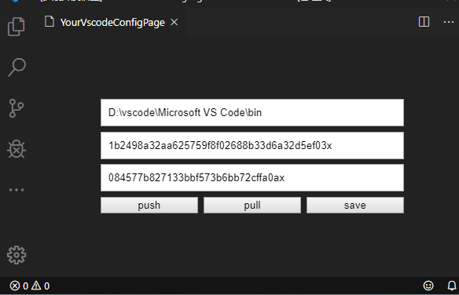

# your-vscode-config

vscode插件，同步本地的`settings.json`和`extentions`

1. 创建一个gist并获取gist的id，在gist中创建一个`c.json`的文件，配置会被写入进去
2. 创建一个github的token，并给与`repo`和`gist`权限。
3. 使用vscode快捷键`ctrl+P`，并输入`your vscode config`将会出现以下页面

inputs:
- 第一个input填写`vscode`的`bin`目录
- 第二个input填写`githubToken`
- 第三个input填写`gistId`

buttons: 
- `push`按钮将会保存`inputs`的配置，并把本地的`settings.json`和`extensions`保存到`gist`
- `pull`按钮将会拉取`gist`上保存的配置，并设置到本地`settings.json`，和安装`extensions`，安装过程非常缓慢，耐心等待就好，安装完成后重启`vscode`. (自动安装很可能会失败，您可以选择手动安装)
- `save`按钮，只会保存`inputs`的配置

具体可以看源码。